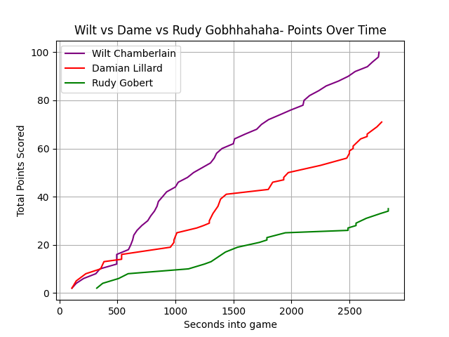

# Wilt Chamberlain 100-Point Game Simulation (🐍  Python Version)

This script simulates Wilt Chamberlain's historic 100-point game by generating a score graph using Python.

## 📂 Files Needed

- `simulate.py` — the Python script
- `files/wilt.json` — Wilt Chamberlain scoring events
- `files/dame.json` — Damian Lillard scoring events
- `graph.png` — output graph image

## ⚙️ Requirements

- Python 3.x
- `virtualenv` or built-in `venv`

## 🛠️ Setup Instructions

1. Create and activate a virtual environment:

```bash
# Create a virtual environment
python3 -m venv venv

# Activate it
# MacOS/Linux
source venv/bin/activate
```

2. Install dependencies inside the venv:

```bash
pip install matplotlib
```

## ▶️ How to Run

Make sure your virtual environment is activated, then run:

```bash
python simulate.py
```

After running, a file called `graph.png` will be created, showing a line graph of scores over time.

## 🖼️ Example Output



The x-axis represents game time (seconds), and the y-axis shows cumulative points for Wilt, Dame, and Others.

---

# 📌 Notes

- Always activate the virtual environment (`source venv/bin/activate`) before running.
- The script reads scoring events from JSON files.
- Points are accumulated over time and plotted using `matplotlib`.
- Customize the simulation speed or graph styling by editing `simulate.py`.

